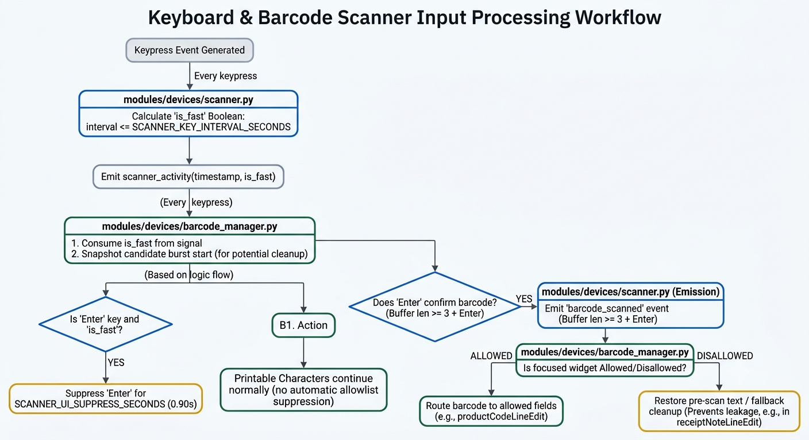

# BarcodeManager - Current Behavior

This document describes the current behavior of `BarcodeManager` in `modules/devices/barcode_manager.py`.

## Purpose

`BarcodeManager` centralizes scanner behavior:

- Routes scanned barcodes to the sales table or dialog-owned product-code fields.
- Cleans scan leaks via snapshot restore, protected-field stable text restore, with single-character cleanup as fallback.
- Protects main-window manual fields while still allowing normal main-window scan-to-cart behavior.
- Blocks scanner-driven main-window actions while modal dialogs are open.
- Suppresses Enter/Return during scanner bursts to avoid unintended button clicks.
- Writes ignored/failed completed-scan diagnostics to the dedicated external
  `logs/barcode_routing.log` file; successful scans are not logged.

## Core Concepts

### 1) Main Window Scanner Surface

The main window is the default scanner surface. When no modal/special context blocks routing, a confirmed scan is treated as a sales-table barcode:

- Product found: `handle_barcode_scanned(...)` adds/increments the item.
- Product not found: Product Menu opens in ADD mode with the scanned code.
- After a successful add/increment, focus is explicitly returned to the
  `salesTable` widget (not a row `qtyInput`) so the next scan has a stable,
  non-protected focus target.

Because the main window must allow scan-to-cart, it is **not** globally scanner-blocked. Instead, `BarcodeManager` selectively protects manual-entry widgets that must never receive or route scans:

- `qtyInput`
- `tenderValLineEdit`
- `cashPayLineEdit`
- `netsPayLineEdit`
- `paynowPayLineEdit`
- `voucherPayLineEdit`

For these protected fields:

- Printable scanner characters are swallowed during a confirmed scanner-fast burst.
- The field is restored to its last stable manual value.
- The completed scan is ignored if it started in, or ends focused on, a protected field.
- Normal manual typing and Enter behavior remain available outside the scanner-burst window.

### 2) Modal Block

`_modalBlockScanner` is enabled by `DialogWrapper.open_dialog_scanner_blocked(...)` while most dialogs are open.

- Confirmed scans are prevented from reaching main-window routing.
- Keystrokes inside the active modal are allowed so normal typing still works.
- Keystrokes outside the active modal are blocked as a fail-safe.

### 3) Barcode Override

Dialogs are scanner-blocked by default. Dialogs that intentionally accept scanner input temporarily expose `dlg.barcode_override_handler`; `DialogWrapper` installs it through `set_barcode_override(...)` and clears it on cleanup.

Override routing is checked first in `on_barcode_scanned()`.

Current rule:

- The override may consume a scan when focus is in a widget whose `objectName` ends with `ProductCodeLineEdit`.
- If focus shifts mid-scan, the override may still consume it if the scan started in a `*ProductCodeLineEdit`.
- Otherwise the scan is rejected, leaked text is restored/cleaned, and the dialog may show "Scan only in Product Code field".

Dialogs without a barcode override behave like scanner-blocked modals: scanner input is rejected instead of being routed to the sales table.

Known limitation: rejected scans in dialog name-search fields can still leave a single leaked character. The scan is not accepted and does not route as barcode input, but HID keyboard timing can allow one character to land before the rejected-scan cleanup runs.

### 4) HOLD_LOADED Cart Protection

When `receipt_context.source == 'HOLD_LOADED'`, scanner-driven sales-table routing is blocked.

This check happens after dialog override routing, so product-code dialogs can still accept scans when focused correctly.

### 5) Routing Order

`on_barcode_scanned()` routes a completed scan in this order:

1. Dialog override, if installed and scan started/ended in a `*ProductCodeLineEdit`.
2. `receipt_context.source == 'HOLD_LOADED'`: ignore scan + restore/cleanup leak.
3. `_modalBlockScanner`: ignore scan + restore/cleanup leak.
4. Main-window protected manual field: ignore scan + restore/cleanup leak.
5. Sales-table barcode routing.

## Diagnostic Log

`modules/devices/barcode_routing_logger.py` appends one JSON object per line to
`config.BARCODE_ROUTING_LOG_PATH` (`logs/barcode_routing.log`). It records only
completed scans that are ignored or fail, including:

- Local timestamp with UTC offset
- Outcome and routing reason
- Barcode
- Scan-start widget and completion-time focused widget
- Receipt source, status, and active receipt ID
- Modal-block and barcode-override state
- Sales-table readiness, presence, and row count
- Exception representation when routing raises

The logger is best-effort and must never interrupt scanning or transaction
processing. `error.log` remains reserved for application errors and status-footer
reporting.

## Scan-Burst Timing



The diagram's `confirmation.py` box is conceptual; the confirmed `barcode_scanned` signal is emitted by `modules/devices/scanner.py`.

`scanner.py` owns scanner/manual timing. It uses `SCANNER_KEY_INTERVAL_SECONDS` and emits:

```python
scanner_activity(timestamp, is_fast)
```

`BarcodeManager` consumes `is_fast`; it no longer re-checks a separate interval.

During scanner-fast activity, `BarcodeManager`:

- Snapshots the focused editable widget at the start of a possible burst.
- Suppresses Enter/Return for `SCANNER_UI_SUPPRESS_SECONDS`.
- Blocks printable scanner characters only during the confirmed scanner-burst window and only when the focused widget is not barcode-allowed.

This keeps the scanner's trailing Enter from submitting forms, protects main-window manual fields, and avoids blocking ordinary manual typing outside the scanner-burst window.

## Leak Cleanup

When a confirmed scan is rejected or ignored, `BarcodeManager` restores text in this order:

1. Protected main-window manual fields restore from their stable manual text memory.
2. Other editable widgets restore from `_preScanText`, captured at scan-burst start.
3. If no snapshot is available, `_cleanup_scanner_leak(...)` removes the trailing first character of the scanned barcode when present.

`QDateEdit` widgets are handled through their internal `lineEdit()`, so report/receipt date fields can restore pre-scan text and clean leaked scanner characters through the same shared path.

Dialog name-search fields may still show a single leaked character after a rejected scan. This is treated as a limitation of the current HID scanner cleanup approach; name-search fields remain manual fields and are not barcode-owned.

The stable protected-field memory is needed because the first scanner character can land before a burst is confirmed. It preserves values such as a sales-table quantity or payment amount and removes the first-character leak reliably.

## Integration Points

- `main.py` creates `BarcodeManager` and installs it as an app event filter.
- `DialogWrapper.open_dialog_scanner_blocked(...)` toggles modal block and clears overrides on close.
- Dialogs that accept scans should name product-code fields with an `objectName` ending in `ProductCodeLineEdit`.
- Main-window fields that must reject scanner input should be added to `PROTECTED_MANUAL_FIELD_NAMES`.

## Notes On Legacy

Do not restore the old manager from `Documentation/barcode_managerOLD.md` / `POS temp/barcode_managerOLD.py`.

Known legacy issues:

- Brittle modal typing allow-list.
- Incomplete product-found routing.
- Weaker support for the `*ProductCodeLineEdit` convention.
