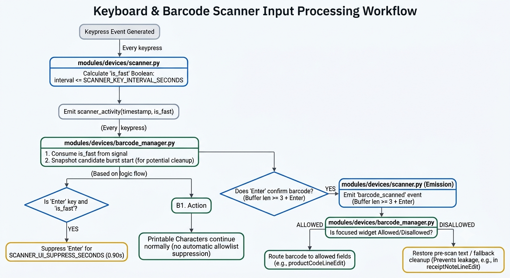

# BarcodeManager - Current Behavior

This document describes the current behavior of `BarcodeManager` in `modules/devices/barcode_manager.py`.

## Purpose

`BarcodeManager` centralizes scanner behavior:

- Routes scanned barcodes to the sales table or dialog-owned product-code fields.
- Cleans scan leaks via snapshot restore, protected-field stable text restore, with single-character cleanup as fallback.
- Protects main-window manual fields while still allowing normal main-window scan-to-cart behavior.
- Blocks scanner-driven main-window actions while modal dialogs are open.
- Suppresses Enter/Return during scanner bursts to avoid unintended button clicks.

## Core Concepts

### 1) Main Window Scanner Surface

The main window is the default scanner surface. When no modal/special context blocks routing, a confirmed scan is treated as a sales-table barcode:

- Product found: `handle_barcode_scanned(...)` adds/increments the item.
- Product not found: Product Menu opens in ADD mode with the scanned code.
- After a successful add/increment, focus is explicitly returned to the
  `salesTable` widget (not a row `qtyInput`) so the next scan has a stable,
  non-protected focus target.

Because the main window must allow scan-to-cart, it is **not** globally scanner-blocked. Instead, `BarcodeManager` selectively protects manual-entry widgets that must never receive or route scans:

- `qtyInput`
- `tenderValLineEdit`
- `cashPayLineEdit`
- `netsPayLineEdit`
- `paynowPayLineEdit`
- `voucherPayLineEdit`

For these protected fields:

- Printable scanner characters are swallowed during a confirmed scanner-fast burst.
- The field is restored to its last stable manual value.
- The completed scan is ignored if it started in, or ends focused on, a protected field.
- Normal manual typing and Enter behavior remain available outside the scanner-burst window.

### 2) Modal Block

`_modalBlockScanner` is enabled by `DialogWrapper.open_dialog_scanner_blocked(...)` while most dialogs are open.

- Confirmed scans are prevented from reaching main-window routing.
- Keystrokes inside the active modal are allowed so normal typing still works.
- Keystrokes outside the active modal are blocked as a fail-safe.

### 3) Barcode Override

Dialogs are scanner-blocked by default. Dialogs that intentionally accept scanner input temporarily expose `dlg.barcode_override_handler`; `DialogWrapper` installs it through `set_barcode_override(...)` and clears it on cleanup.

Override routing is checked first in `on_barcode_scanned()`.

Current rule:

- The override may consume a scan when focus is in a widget whose `objectName` ends with `ProductCodeLineEdit`.
- If focus shifts mid-scan, the override may still consume it if the scan started in a `*ProductCodeLineEdit`.
- Otherwise the scan is rejected, leaked text is restored/cleaned, and the dialog may show "Scan only in Product Code field".

Dialogs without a barcode override behave like scanner-blocked modals: scanner input is rejected instead of being routed to the sales table.

Rejected dialog scans restore after the short UI settling delay so queued HID
characters cannot remain in the field.

### 4) HOLD_LOADED Cart Protection

When `receipt_context.source == 'HOLD_LOADED'`, scanner-driven sales-table routing is blocked.

This check happens after dialog override routing, so product-code dialogs can still accept scans when focused correctly.

### 5) Routing Order

`on_barcode_scanned()` routes a completed scan in this order:

1. Dialog override, if installed and scan started/ended in a `*ProductCodeLineEdit`.
2. `receipt_context.source == 'HOLD_LOADED'`: ignore scan + restore/cleanup leak.
3. `_modalBlockScanner`: ignore scan + restore/cleanup leak.
4. Main-window protected manual field: ignore scan + restore/cleanup leak.
5. Sales-table barcode routing.

## Scan-Burst Timing



The diagram's `confirmation.py` box is conceptual; the confirmed `barcode_scanned` signal is emitted by `modules/devices/scanner.py`.

`scanner.py` owns scanner/manual timing and emits:

```python
scanner_activity(timestamp, is_fast)
```

During the temporary production investigation, scanner input and routing outcomes
are summarized in the independent `live_logs/barcode_scanner_trace.log`; anomalies
are written immediately. See
`Documentation/barcode_scanner_trace.md` for scope, interpretation, and removal.

The scanner retains printable characters until Enter and classifies the whole
sequence. `SCANNER_KEY_INTERVAL_SECONDS = 0.05` marks individual fast gaps but
does not reset the buffer. Only
`SCANNER_CANDIDATE_INACTIVITY_SECONDS = 0.75` abandons an unfinished candidate.
Final classification considers average timing, fast-gap ratio, and length; see
`barcode_scanner_algorithm_improvement.md`.

During scanner-fast activity, `BarcodeManager`:

- Snapshots editable text synchronously in Qt before the first candidate key is
  inserted; listener activity provides a fallback snapshot.
- Suppresses Enter/Return for `SCANNER_UI_SUPPRESS_SECONDS`.
- Allows ambiguous printable input to reach the widget.
- Restores non-product-code editable fields after the complete sequence is
  confirmed as a scan.

This keeps the scanner's trailing Enter from submitting forms while avoiding
speculative loss of rapid manual keystrokes.

## Leak Cleanup

When a confirmed scan targets a non-product-code field, including a scan later
rejected or ignored by routing, `BarcodeManager` restores text in this order:

1. Protected main-window manual fields restore from their stable manual text memory.
2. Other editable widgets restore from `_preScanText`, captured at scan-burst start.
3. If no snapshot is available, `_cleanup_scanner_leak(...)` removes the trailing first character of the scanned barcode when present.

Restoration is deferred by `SCANNER_UI_SETTLE_MS` so pending Qt key events land
before the saved value is reapplied. Successful dialog overrides use the same
delay to reapply the complete barcode; leak cleanup is never run against an
authoritative product-code value.

`QDateEdit` widgets are handled through their internal `lineEdit()`, so report/receipt date fields can restore pre-scan text and clean leaked scanner characters through the same shared path.

Dialog name-search fields remain manual fields and are not barcode-owned.
One isolated rejected scan restores normally. Rapid repeated scans into the
same ordinary non-barcode field can overlap snapshots and settling timers and
may leave scanner text visible; this is an accepted HID limitation outside the
supported cashier scan workflow.

The stable protected-field memory is needed because the first scanner character can land before a burst is confirmed. It preserves values such as a sales-table quantity or payment amount and removes the first-character leak reliably.

## Integration Points

- `main.py` creates `BarcodeManager` and installs it as an app event filter.
- `DialogWrapper.open_dialog_scanner_blocked(...)` toggles modal block and clears overrides on close.
- Dialogs that accept scans should name product-code fields with an `objectName` ending in `ProductCodeLineEdit`.
- Main-window fields that must reject scanner input should be added to `PROTECTED_MANUAL_FIELD_NAMES`.

## Notes On Legacy

Do not restore the old manager from `Documentation/barcode_managerOLD.md` / `POS temp/barcode_managerOLD.py`.

Known legacy issues:

- Brittle modal typing allow-list.
- Incomplete product-found routing.
- Weaker support for the `*ProductCodeLineEdit` convention.
